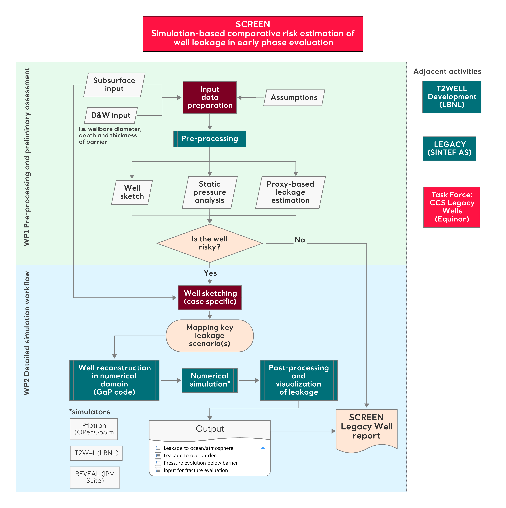

# SCREEN
## Simulation-based comparative risk estimation of well leakage in early phase evaluation (SCREEN)

Compilation of scripts that support the actviities on the <a href="https://colab.equinor.com/technologies/4FAAF5BD-19C3-46A3-ACB6-5D38DD2C7A89/summary" target="_blank">SCREEN project</a>.


### Methodology

The `SCREEN` method is a tool to analyze data relevant to legacy wells and estimate leakage of CO2. It consists of three main modules: `Data Preparation`, `Data Visualization and Proxy-based Leakage Estimation`, and `Simulation-based Leakage Estimation`.

#### Data Preparation
The first step in using the `SCREEN` method is to gather all the necessary data to build a plugged and abandoned well sketch, along with any relevant subsurface data surrounding the well. This data should be prepared in a CSV file with multiple tables, each separated by a blank line.

To collect the data these are some steps that can be followed:

•	**Identify the required data**: Review the list of required tables and columns in the input data file to determine what information you need to gather. This includes well header information, drilling intervals, casing and cementing intervals, barriers, geological units, and assumptions.

•	**Collect the data**: Gather the necessary data from various sources. The information in the first tables should be available from the final well reports. Retrieving the data may involve manually scouting numbers in the reports that could be presented in different places and different formats. Other databases can be referred to retrieve temperature data or updated geological well tops.

•	**Verify the data**: Check the accuracy and completeness of the data by cross-referencing it with multiple sources and verifying it with domain experts. Ensure that all required tables and columns are included in the input data file and that the data is entered correctly.

•	**Organize the data**: Organize the data into tables according to the structure of the input data file. Use a spreadsheet program or a text editor to create a CSV file with multiple tables, each separated by a blank line.

•	**Include assumptions**: The assumptions depend on the stage of knowledge of the area. If there is a reservoir model in place, this should be used to fill in the information for these tables. Otherwise these should discussed with the subsurface personnel involved in the project.

The CSV file shall include the following tables:

•	**well_header**: This table contains general information about the well, such as its name (well_name), RKB elevation (well_rkb), depth of the sea floor (sf_depth_msl), total depth (well_td_rkb), sea floor temperature (sf_temp), and geothermal gradient (geo_tgrad).

•	**drilling**: This table contains information about the drilling intervals of the well, including the top and bottom depths in RKB (top_rkb, bottom_rkb) and the diameter of the borehole in inches (diameter_in).

•	**casing_cement**: This table contains information about the casing and cementing intervals of the well, including the top and bottom depths in RKB (top_rkb, bottom_rkb), diameter of the casing in inches (diameter_in), top  and bottom of cement-bond in RKB (toc_rkb, boc_rkb), and whether or not it has a shoe (shoe).

•	**barriers**: This table lists the barriers in the well along with their name (barrier_name), type (barrier_type), and top and bottom depths in RKB (top_rkb, bottom_rkb).

•	**geology**: This table lists the geological units encountered in the well along with their top depth in RKB (top_rkb), name (geol_unit), and whether or not they are considered a reservoir (reservoir_flag).

•	**assumptions**: This section includes several tables with information about assumptions used in the analysis, such as reservoir pressure scenarios (reservoir_pressure), CO2 datum depth (co2_datum), main barrier name (main_barrier), and barrier permeability values for different quality levels (barrier_permeability).

Here is an example of how the CSV file could be structured, along with explanations for each table:

input_data

```
well_header
well_name,wellA
well_rkb,30
sf_depth_msl,105
well_td_rkb,3997
sf_temp,4
geo_tgrad,40

drilling
top_rkb,bottom_rkb,diameter_in
132,190,36
190,444,26
444,1812,17 1/2
1812,3942,12 1/4
3942,3997,8 1/2

casing_cement
top_rkb,bottom_rkb,diameter_in,toc_rkb,boc_rkb,shoe
132,158,30,132,158,TRUE
132,439,20,132,439,TRUE
182,1803,13 3/8,450,1803,TRUE

barriers
barrier_name,barrier_type,top_rkb,bottom_rkb
cement plug #3,cplug,132,150
cement plug #2,cplug,1690,1850
cement plug #1,cplug,2050,2300

geology
top_rkb,geol_unit,reservoir_flag
132,OVERBURDEN,FALSE
2122,CAP ROCK,FALSE
2265,RESERVOIR,TRUE

assumptions

reservoir_pressure
depth_msl,RP1,RP2
2238,90 110

co2_datum
co2_msl,2370

main_barrier
barrier_name,cplug2

barrier_permeability
quality,kv
good,0.01
mid,10
poor,1.00E+03
```

#### Data Visualization and Proxy-based Leakage Estimation

Once all the information is tabulated, it can be processed with a python script. The processing will store the data in memory and use it to produce a hybrid geological well-sketch and a pressure-depth plot displaying the fluid pressures of each phase and the minimum horizontal stress.

The well sketch combines both subsurface data and well engineering information. It serves as a starting point to identify the main leakage pathways and illustrate the main risks associated with the well.

The pressure plot, besides visualizing the provided pressure scenarios, has the necessary input to run a preliminary leakage estimation based on a Darcy-based proxy. This proxy gives an estimate of leakage rates through the main barrier (deepest cement plug). The magnitude will be a function of both the transport properties assigned to the barrier and the resulting phase pressures of each scenario.


#### Simulation-based Leakage Estimation

For wells with larger uncertainties and more complex leakage pathways, a simulation-based approach can assist in generating a more accurate estimate of leakage.

By fulfilling the first two modules, the data is ready to be processed through a second script that generates and initializes a simple reservoir model with a finite-volume representation of the legacy well.

The generated mesh is a coarse mesh with `local grid refinement (LGR)` in the middle. The higher resolution of the LGR is used to represent well construction details.

Due to the cartesian nature of the mesh, the cylindrical shape of the well is turned into a prism. A horizontal cross-section of the well in the LGR is square, with sides meant to preserve the area of the original circle. However, discrepancies between volumes may occur due to mesh resolution.

The transport properties of geological units are inherited from coarse grid and updated to represent well. Open borehole is represented by high permeability grid cells. Cement plugs and cement-bond are represented by low permeability cells. Casing is represented by reduction of transmissibility of cell interfaces.

#### SCREEN Workflow

